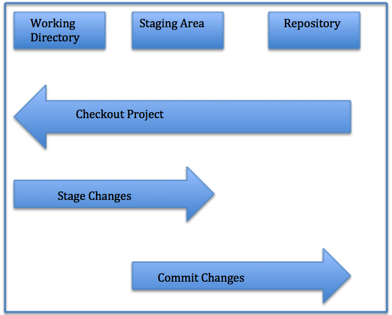

- [Growth Mindset](https://zenatomsk.github.io/reading-notes/)
- [Learning Markdown](https://zenatomsk.github.io/reading-notes/01-learning-markdown) 
- [The Coder's Computer](https://zenatomsk.github.io/reading-notes/02-the-coders-computer)
- [Terminal revision and the cloud....or the matrix](https://zenatomsk.github.io/reading-notes/03-revisions-and-the-cloud)
- [Html-the structure](https://zenatomsk.github.io/reading-notes/04-structure-with-html)
- [Where do you want it and what color?](https://zenatomsk.github.io/reading-notes/05-design-with-css)
- [Let's make it do stuff and things](https://zenatomsk.github.io/reading-notes/06a-dynamic-with-javascript)
- [Computer architecture and logic](https://zenatomsk.github.io/reading-notes/06b-computer-architecture-and-logic)
- [You need coffee for all this Java..Script](https://zenatomsk.github.io/reading-notes/07-programming-with-js)
- [Answer how I want you to answer, or this loop will never close](https:zenatomsk.github.io/reading-notes/08-operators-and-loops)

# reading notes

## Important commands in order

>git add README.md (file name)

>git status

>git commit -m "message"

>git status

>git push origin master

>github username

>github password

## **Version Control**

Version control is a system that allows you to revisit various versions of a file or set of files by recording changes.
Through version control, one can revert a file or project to a previous version, track midifications and modifying individuals,
and compare changes.
By using a VCS, mistakes with files can easily be rectified.

### **Local version control**

Many years ago, programmers created Local Version Control systems. 
A Local VCS entails one database on your hard disk that stores changes to files.

### **Centralized Version Control**

The need for collaboration within a developer team on a single file or set of files led 
to the advent of the Centralized Version Control System (CVCS). This system entails a 
single server storing all changes and file versions, which can be accessed by various clients. 
This streamlined the collaboration process (by eliminating the need to involve all local databases), 
allowed programmers to have more knowledge of team members’ activities with certain files, and gave 
administrators much more control over divvying up revision privileges.

### **Distributed Version Control**

A Distributed Version Control systems (DVCS) addresses the major vulnerability of the CVS: the server as a
single point of failure. If a CVS goes down, collaborators cannot work with each other on a file or save
changes and new versions. Also, in the event of corruption of a central database’s hard disk — with the
absence of backups — all work will be lost, except for any portions on local machines.

To prevent this type of catastrophic loss, a DVCS allows clients to create mirrored repositories. These data
backups can be easily be placed on the server to replace any lost information.

Because the DVCS allows for multiple mirrored repositories, programmers working in teams can
collaborate with each other in various ways to complete a joint project, which enables the use of various
simultaneous workflows.

### **So, what is Git?**

* **Snapshots**
  - Git is a DVCS that stores data in a file system made up of snapshots. Each time you save a changed version of you project
  (called a commit) Git creates a snapshot of the file and stores a reference to it. if the file has not changed, Git only stores
  a reference to the already stored identical version of it.
  
* **Local Operations**
  - Git mostly relies on local operations because most necessary information can be found in local resources.
  This allows for process expediency because a project's history resides on the local disk, elimination the 
  need to fetch history information from the server, and allowing one to continue work on a project even when not online or on a VPN
  
* **Tracking Changes**
  - every single change applied to any file or directory is tracked by Git. And, as the gatekeeper, Git will always detect file
  corruption or loss of information in transit.
  
* **Loss of Data**
  - Git is set up to greatly minimize the possibility of irreversible damage to files, such as accidentally lost data. Git makes it extremely
  difficult for a snapshot of your file that is commited to be lost.
  
* **States**
  - Files in Git can reside in three main states: committed, modified and staged.
  
  *Committed*
  Data is securely stored in a local database
  
  *Modified*
  File has been changed but not committed to the database
  
  *Staged*
  Flagged a file's changed version to be commited in the net snapshot
  

  
## **History of Git**

Git traces its roots to the open source software project Linux kernel. Developers of this project began
using a DVCS called BitKeeper in 2002. In 2005, many of these developers stopped using this DVCS due to
tension between the Linux kernel community and the company behind BitKeeper’s and the eventual
revocation of the DVCS’ gratis status. Subsequently, Linus Torvalds, the chief architect of the Linux kernel,  
began creating Git. With the intention of creating a DVCS with a workflow design similar to that of  
BitKeeper, which was also fast, Git allowed for non-linear development via multiple branches, could  
support large projects, possessed strong mechanisms preventing corruption, and had a simple design.
Since its inception in 2005, Git has become one of the most utilized Version Control Systems in the world.

## **Getting Started**

### **Download Git**

In order to use Git, your computer must have it available. If you already have Git on you computer,
you should make sure you have the latest version.

*Git can be installed in three ways:*
  1. Install as a package
  2. Install via another installer
  3. Download and compile the source code.

### **Graphical Clients**

Git includes inherent Graphical User Interface (GUI) tools. However, users can also utilize third-party tools 
created for particular platforms.

*GUI Clients*

You can access a variety of GUI clients for Mac, Windows, and Linux [here](https://git-scm.com/downloads/guis).

### **Initial customization**

After making sure Git has been installed, you should perform some customization steps, which should only need to be completed once on any machine. 
To change settings, you can repeat these steps.

**Configuration of Variables**

An inherent Git tool called git config allows the setting of configuration variables that control aspects of Git’s operation and look.

**Identity Setting**

After installing Git, users should immediately set the user name and email address, which will be used for every Git commit.

Type the following into Terminal or Command Line:

> git config --global user.name "username"

> git config --global user.email "email@email.com"

To confirm that you have the correct settings, enter the following command:

> git config --global user.name (should retrun username)

> git config --global user.email (should return email@email.com) 

  - by using the -global option, these Git settings apply to anything on the system. To use different identity settings for a specific project, 
  change the working directory to the desired local to the desired local Git repository and repeat the steps above without using -global

