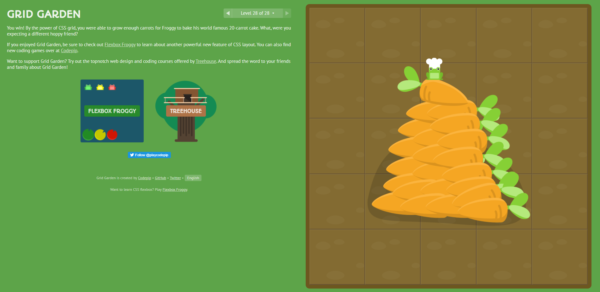

# **CSS Grid**

### References:
- [CSS-Tricks GRID](https://css-tricks.com/snippets/css/complete-guide-grid/)
- [Good article with examples](https://medium.com/samsung-internet-dev/common-responsive-layouts-with-css-grid-and-some-without-245a862f48df)

## **A Complete Guide to Grid**

CSS Grid Layout is the most powerful layout system available in CSS. It is a 2-dimensional system, meaning it can handle both columns and rows, unlike flexbox which is largely a 1-dimensional system. You work with Grid Layout by applying CSS rules both to a parent element (which becomes the Grid Container) and to that element’s children (which become Grid Items).

CSS Grid Layout (aka “Grid”), is a two-dimensional grid-based layout system that aims to do nothing less than completely change the way we design grid-based user interfaces. CSS has always been used to lay out our web pages, but it’s never done a very good job of it. First, we used tables, then floats, positioning and inline-block, but all of these methods were essentially hacks and left out a lot of important functionality (vertical centering, for instance). Flexbox helped out, but it’s intended for simpler one-dimensional layouts, not complex two-dimensional ones (Flexbox and Grid actually work very well together). Grid is the very first CSS module created specifically to solve the layout problems we’ve all been hacking our way around for as long as we’ve been making websites.

Fluid width columns that break into more or less columns as space is available, with no media queries!

    .grid {

    display: grid;

    grid-template-columns: repeat(auto-fill, minmax(200px, 1fr));

    /* This is better for small screens, once min() is better supported */
    /* grid-template-columns: repeat(auto-fill, minmax(min(200px, 100%), 1fr)); */

    grid-gap: 1rem;

    /* This is the standardized property now, but has slightly less support */
    /* gap: 1rem */
    }

## **Common Responsive Layouts with CSS Grid** .

    The Holy Grail Layout (with no set heights!)
    body {
    display: grid;
    grid-template-columns: 200px 1fr 200px;
    grid-template-rows: auto 1fr auto;
    height: 100vh;
    }

