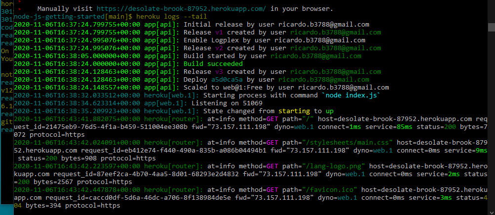

# Heroku

## **Node.js For Beginners. Deploy Your Blog to Heroku**

Error pages are not what typically appear on your screen when you're surfing the web, but when it happens it's so annoying! To see how servers work from within, we will build a simple web server by ourselves. We will use Node.js as a server part technology for that task. Then we'll use Heroku cloud application platform to turn this local server into a world wide server.

### How can I?

We will use Node.js for our project. Node.js is an open source, cross-platform runtime environment, which allows you to build server-side and networking applications. It's written in JavaScript and can be run within the Node.js runtime on any platform. First of all, of course, you need to install it. You'd better check the download page for more details. I'll wait until you finish, so don't worry. Is it done? Great! Now you can create your first web server. And it will be one of the easiest tasks in your life.

Pretty simple, but it's a server!

First of all, we need to create a JavaScript file. Let's name it server.js:

    server.js
    var http = require("http");

    http.createServer(function(request, response) {
      response.writeHead(200, {"Content-Type": "text/plain"});
      response.write("It's alive!");
      response.end();
    }).listen(3000);

It's simple. It's tiny. But it's a server! Let's make sure it's working. Run at your terminal:

    node server.js

Then check it in your browser. Your new server's address, as you may guess, is http://localhost:3000/ Mine is working. How about yours? Hope, it's working too.

Now, to be sure it's a web server and not just a piece of code that returns a single line of text, we'll use it as a server! You can check it with your smartphone. Let's suppose, your laptop's IP address within your local network is 192.168.1.101. You can connect to your server through the 3000th port (for this particular example) by typing http://192.168.1.101:3000/ in your browser. Works well in my case:

Well, it is a server! And we have evidence. What you got here is your own client-server model, which can fit in your bag! Take it any place you want! It will be a good idea to deploy our server online, so everyone could see it.

But you should notice something, before we go further. Let's look more closely at our first Node server. This is an example of how Node provides you with non-blocking and event-driven behavior. 

    $.post('/some_requested_resource', function(data) {
    console.log(data);
    });

This code performs a request for some resource. When the response comes back, an anonymous function is called. It contains the argument data, which is the data received from that request.

So, Node allows you to use the so-called event loop, which works faster because of non-blocking behavior. For example, nginx uses an event loop with asynchronous I/O. That's why it's fast as hell!

### Make it worldwide

Works fine. But it works locally. WWW is for "World Wide Web" and we will turn your local server into a world wide server. We'll use Heroku cloud application platform for this. Heroku is a cloud platform as a service (cool long-bearded programmer guys call such type of things "PaaS"). It allows you to deploy your web server, so everyone could see how awesome you are as a web developer. First of all, you need to create an account on developer's site and install Heroku. This is not so hard. Just follow the instructions. There is also instruction on Heroku's site that can explain you how to run your first simple web server, which returns you the "Hello, World!" string. You can try it, but I think that it will be more interesting if we build our own web server from scratch. Sounds exciting, huh?

Looking back

We've built our own web server using less than 50 lines of code. Not so hard, if you ask me. It's pretty simple, yes. But you can see, how average server works. It was a simple task. But you can combine Node.js with different technologies, such as CSS3 and HTML5, then spice it with some JavaScript functionality. There is really a lot of libraries and frameworks to take a look at. Personally I started to dig into Webix, it's a relatively new library and is developed by a small software company from Eastern Europe. Samples of apps made with the library and Node.js: CRM and task planner. Seems like you can create anything with the right client-side framework and Node.js.

And, talking about Node.js as a technology...

...it will make your DIRTy job for you.
There is an acronym created to describe such type of applications Node.js was created for. It's DIRT. It means Data-Intensive Real-Time applications. Node allows a server to handle a lot of connections and work with a number of requests at the same time. And you don't need much memory for that. It's designed to be responsive and fast. Just like your web browser! So, it's useful when you need to create an application that will be able to respond instantly to a large number of users. And Node was built from scratch to provide you with such a functionality.

