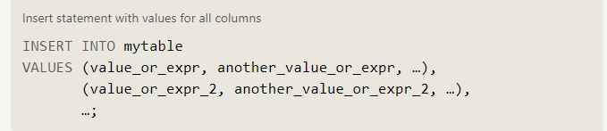

# **SQL**

## What is SQL?

**SQL**, or ***Structured Query Language***, is a language designed to allow both technical and non-technical users query, manipulate, and transform data from a relational database. And due to its simplicity, SQL databases provide safe and scalable storage for millions of websites and mobile applications.

## Relational databases

A relational database represents **a collection of related (two-dimensional) tables**. Each of the tables are **similar to an Excel spreadsheet**, with a fixed number of named columns (the attributes or properties of the table) and any number of rows of data.

By learning SQL, the goal is to learn how to answer specific questions about this data to help us make better decisions down the road.

## SELECT queries

To retrieve data from a SQL database, we need to write **SELECT** statements, which are often colloquially referred to as **queries**. A query in itself is just a statement which declares what data we are looking for, where to find it in the database, and optionally, how to transform it before it is returned. It has a specific syntax.

given a table of data, the most basic query we could write would be one that selects for a couple columns (properties) of the table with all the rows (instances).

## **Queries with constraints**

if you had a table with a hundred million rows of data, reading through all the rows would be inefficient and perhaps even impossible. In order to filter certain results from being returned, we need to use a **WHERE** clause in the query. The clause **is applied to each row of data by checking specific column values** to determine whether it should be included in the results or not.

More complex clauses can be constructed by joining numerous **AND** or **OR** logical keywords **(ie. num_wheels >= 4 AND doors <= 2)**.

In addition to making the results more manageable to understand, writing clauses to constrain the set of rows returned also allows the query to run faster due to the reduction in unnecessary data being returned.

When writing WHERE clauses with columns containing text data, SQL supports a number of useful operators to do things like case-insensitive string comparison and wildcard pattern matching.

    All strings must be quoted so that the query parser can distinguish words in the string from SQL keywords.

while most database implementations are quite efficient when using these operators, full-text search is best left to dedicated libraries like **Apache Lucene** or **Sphinx**. These libraries are designed specifically to do full text search, and as a result are more efficient and can support a wider variety of search features including internationalization and advanced queries

## Filtering and sorting Query results

Even though the data in a database may be unique, the results of any particular query may not be. SQL provides a convenient way to discard rows that have a duplicate column value by using the **DISTINCT** keyword. Since the **DISTINCT** keyword will blindly remove duplicate rows, we will learn in a future lesson how to *discard duplicates based on specific columns using grouping* and the ***GROUP BY*** clause.

If you think about websites like Reddit or Pinterest, the front page is a list of links sorted by popularity and time, and each subsequent page can be represented by sets of links at different offsets in the database. Using these clauses, the database can then execute queries faster and more efficiently by processing and returning only the requested content.

## Multi-table queries with JOINs

entity data in the real world is often broken down into pieces and stored across multiple orthogonal tables using a process known as normalization

### Database normalization

Database normalization is useful because it minimizes duplicate data in any single table, and allows for data in the database to grow independently of each other (ie. Types of car engines can grow independent of each type of car). As a trade-off, queries get slightly more complex since they have to be able to find data from different parts of the database, and performance issues can arise when working with many large tables.

### Multi-table queries with JOINs

Tables that share information about a single entity need to have a primary key that identifies that entity uniquely across the database. One common primary key type is an auto-incrementing integer (because they are space efficient), but it can also be a string, hashed value, so long as it is unique.

Using the **JOIN** clause in a query, we can combine row data across two separate tables using this unique key. The first of the joins that we will introduce is the INNER JOIN.

    Select query with INNER JOIN on multiple tables
    SELECT column, another_table_column, …
    FROM mytable
    INNER JOIN another_table 
        ON mytable.id = another_table.id
    WHERE condition(s)
    ORDER BY column, … ASC/DESC
    LIMIT num_limit OFFSET num_offset;

The **INNER JOIN** is a process that matches rows from the first table and the second table which have the same key (as defined by the ON constraint) to create a result row with the combined columns from both tables. After the tables are joined, the other clauses are then applied.

## OUTER JOINs

Depending on how you want to analyze the data, the **INNER JOIN**  might not be sufficient because the resulting table only contains data that belongs in both of the tables.

***If the two tables have asymmetric data***, which can easily happen when data is entered in different stages, then we would have to use a **LEFT JOIN, RIGHT JOIN or FULL JOIN** instead to ensure that the data you need is not left out of the results.

Like the **INNER JOIN** these three new joins have to specify which column to join the data on.

When joining table A to table B, a **LEFT JOIN** simply includes rows from A regardless of whether a matching row is found in B. The **RIGHT JOIN** is the same, but reversed, keeping rows in B regardless of whether a match is found in A. Finally, a **FULL JOIN** simply means that rows from both tables are kept, regardless of whether a matching row exists in the other table.

When using any of these new joins, you will likely have to write additional logic to deal with **NULLs** in the result and constraints

## Inserting rows

### What is a Schema?

In SQL, the database schema is what describes the structure of each table, and the datatypes that each column of the table can contain.

This fixed structure is what allows a database to be efficient, and consistent despite storing millions or even billions of rows.

### Inserting new data

When inserting data into a database, we need to use an INSERT statement, which declares which table to write into, the columns of data that we are filling, and one or more rows of data to insert. each row of data you insert should contain values for every corresponding column in the table. You can insert multiple rows at a time by just listing them sequentially.

In some cases, if you have incomplete data and the table contains columns that support default values, you can insert rows with only the columns of data you have by specifying them explicitly.

In these cases, the number of values need to match the number of columns specified. Despite this being a more verbose statement to write, inserting values this way has the benefit of being forward compatible. For example, if you add a new column to the table with a default value, no hardcoded INSERT statements will have to change as a result to accommodate that change.

In addition, you can use mathematical and string expressions with the values that you are inserting

## Updating rows

In addition to adding new data, a common task is to update existing data, which can be done using an UPDATE statement. Similar to the INSERT statement, you have to specify exactly which table, columns, and rows to update. In addition, the data you are updating has to match the data type of the columns in the table schema.

The statement works by taking multiple column/value pairs, and applying those changes to each and every row that satisfies the constraint in the WHERE clause.

### Taking care

Most people working with **SQL** will make mistakes updating data at one point or another. Whether it's updating the wrong set of rows in a production database, or accidentally leaving out the **WHERE** clause (which causes the update to apply to all rows), you need to be extra careful when constructing **UPDATE** statements.

One helpful tip is to always write the constraint first and test it in a **SELECT** query to make sure you are updating the right rows, and only then writing the column/value pairs to update.

## Deleting rows

When you need to delete data from a table in the database, you can use a DELETE statement, which describes the table to act on, and the rows of the table to delete through the WHERE clause.

If you decide to leave out the WHERE constraint, then all rows are removed, which is a quick and easy way to clear out a table completely (if intentional).

### Taking extra care

Like the UPDATE statement from last lesson, it's recommended that you run the constraint in a SELECT query first to ensure that you are removing the right rows. Without a proper backup or test database, it is downright easy to irrevocably remove data, so always read your DELETE statements twice and execute once.